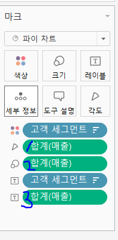

# 1주차 (~3/29) 

---

- 실습 결과 이미지 파일은 `./yerilolilye/1주차/{result, tableau_files}` 에서 확인할 수 있습니다!
- 이번주는 책을 늦게 받아서 추가 실습은 진행을 못했습니다 T.T 그건 다음주부터...

---

## 1. 시작 페이지

 시작 페이지는 크게 `연결`, `열기`, `검색` 영역으로 구분됨.

 1. **연결 영억**

    데이터, 파일, 서버, 저장된 데이터 원본에 연결 가능

2. **열기 영역**

    최근에 열어본 통합 문서를 표시

3. **검색 영역**
    교육 동영상, 블로그 게시글, 버전업 정보 등등

---

## 2. 태블로의 기본 개념

1. **측정값**

    숫자 형식 (정량)

2. **차원**

    측정값을 어떻게 나누어 볼 것인가? (정성)

3. **연속형**

     초록색  필드, 범위가 무한대 (일반적으로 축 추가)

4. **불연속형**

    파란색 필드, 범위가 유한 (일반적으로 머리글 추가)

---

## 3. 막대 차트
### 결과 이미지

### 내용

- 막대차트의 가로, 세로를 바꾸고 싶을 때는 **행과 열 바꾸기** (단축키: `ctrl+w`)를 눌러서 바꿈
- 표준 -> **전체보기**로 바꾸어 막대 크기 확대 가능

- 아래쪽 X축의 '매출'을 클릭하여 그래프를 내림차순으로 정렬 가능

- 매출을 **레이블 마크**로 끌어와 막대 그래프에 매출 값 표시 가능
- **레이블** 마크를 클릭하여 숫자 규격 설정 가능
- **합계(매출) 초록색 버튼 - 속성**을 클릭하여 숫자 표시 단위 설정 가능 
- 마찬가지로 매출을 **색상 마크**로 끌어와 매출액에 따라 그라데이션으로 색상 표현 가능

- 분석-평균라인을 드래그하여 **테이블**에 놓으면 평균 라인 생성됨

- 계산된 필드 만들기에서 수식을 입력해주고, 생성된 필드를 색상 마크로 끌어오면 조건을 만족하는 막대 그래프만 색상이 변경됨

---

## 4. 라인 차트
### 결과 이미지

### 내용

- 날짜 단위별로 끊어서 그래프 나타내기 가능 (불연속형이기 때문)
- 연속형으로 변경도 가능! (열에서 초록색 블록의 오른쪽 화살표 버튼을 클릭했을 때 위쪽이 불연속형, 아래쪽이 연속형 옵션)

- 그 외...
    - 마커가 지저분할 경우 최대/최소, 라인 끝, 하이라이트 등의 옵션을 활용하여 일부만 나타낼 수 있다.

---

## 5. 파이 차트
### 결과 이미지

### 내용
- 파이차트의 정렬 기준은 12시 방향 기준 시계방향으로!

- 합계(매출) 마크가 여러개! 각각 다음을 의미:
    1. 각도
    2. 크기
    3. 레이블
- 구성 비율을 표시하고 싶을 때는 레이블을 기준으로 작업하면 된다.
- 레이블 기준 삼각형 옵션을 클릭한 후, **퀵 테이블 계산 - 구성 비율**을 선택하면 됨!
    - 이렇게 할 경우 기존의 매출액은 사라지므로 다시 레이블로 매출을 드래그&드랍하여 매출액 레이블을 추가해주어야 함
    - 위 사진에서 드래그하여 레이블의 위치를 바꾸면 워크시트 상에서도 위치가 바뀜!
        - 레이블-레이블모양-텍스트에서 직접 타이핑하여 변경도 가능 (괄호 추가 등등의 텍스트 변형도 가능)

- 필터 기능 사용법
    - 원하는 테이블 속성을 필터에 드래그&드랍 후 보고싶은 값 (ex. 2020년만 보겠다!)을 선택하면 됨

- 집합 만들기 기능 사용법
    - 원하는 영역을 선택 (예를들어 70세 이상만 보겠다!)한 후 적절한 이름을 붙여 집합 생성
    - 생성된 집합을 필터에 넣으면 해당 집합에 속하는 값만 볼 수 있음

---

## 6. 도넛 차트

### 결과 이미지

### 내용
- 파이 차트보다 더 많이 쓰임 (부가적인 정보들 더 많이 표시 가능!)

- 열 선반에서 오른쪽 세모 옵션 클릭 - **이중축** 선택하면 그래프가 도넛 형태로 하나로 합쳐짐!
- 크기 마커를 조정하여 도넛 구멍 크기 조정 가능

- 열 선반에서 각 블록을 오른쪽 클릭 - **도구 설명에 포함**을 클릭하여 마우스를 그래프에 갖다 댔을 때 관련 설명이 뜨게/안뜨게 지정 가능
