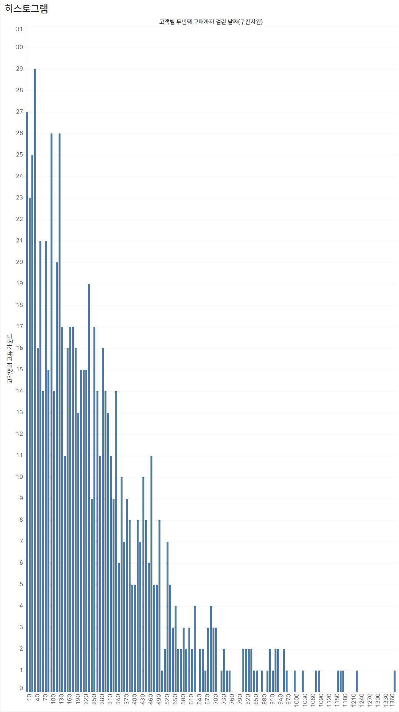
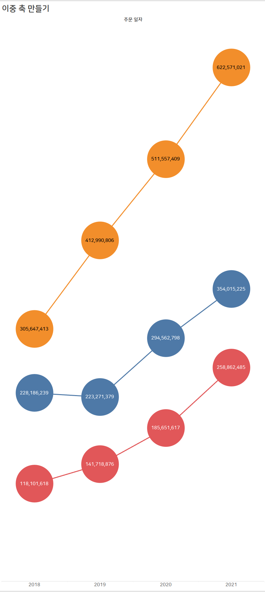
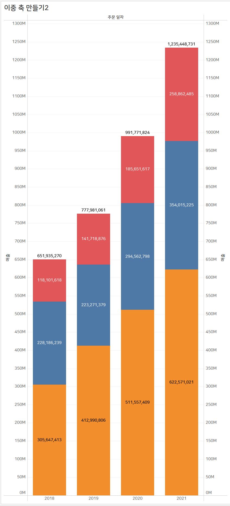
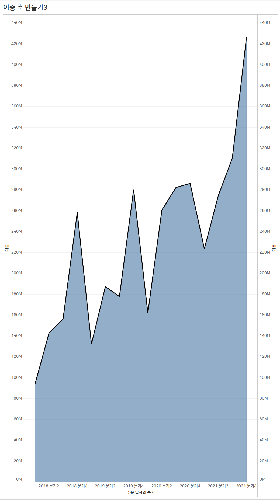
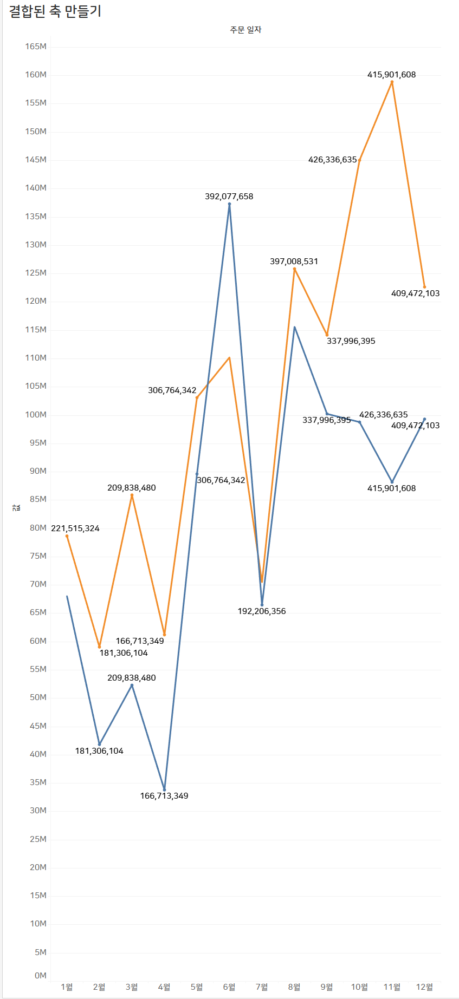

# 3주차 (~4/12) 

---

- 실습 결과 이미지 파일은 `./yerilolilye/3주차/result` 에서 확인할 수 있습니다!

---

## 1. 누적막대차트
### 결과 이미지

---

## 2. 히스토그램
### 결과 이미지

---

## 3. 이중 축 만들기
### 결과 이미지

---

## 4. 결합된 축 만들기
### 결과 이미지
